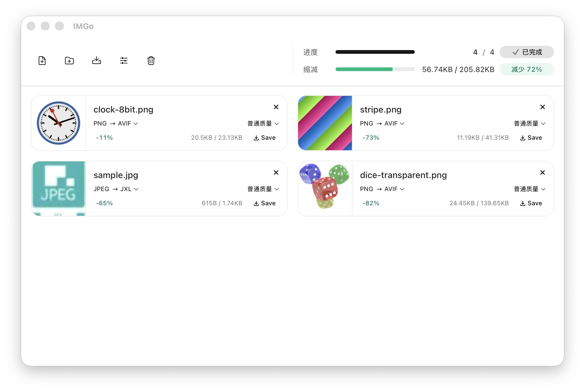
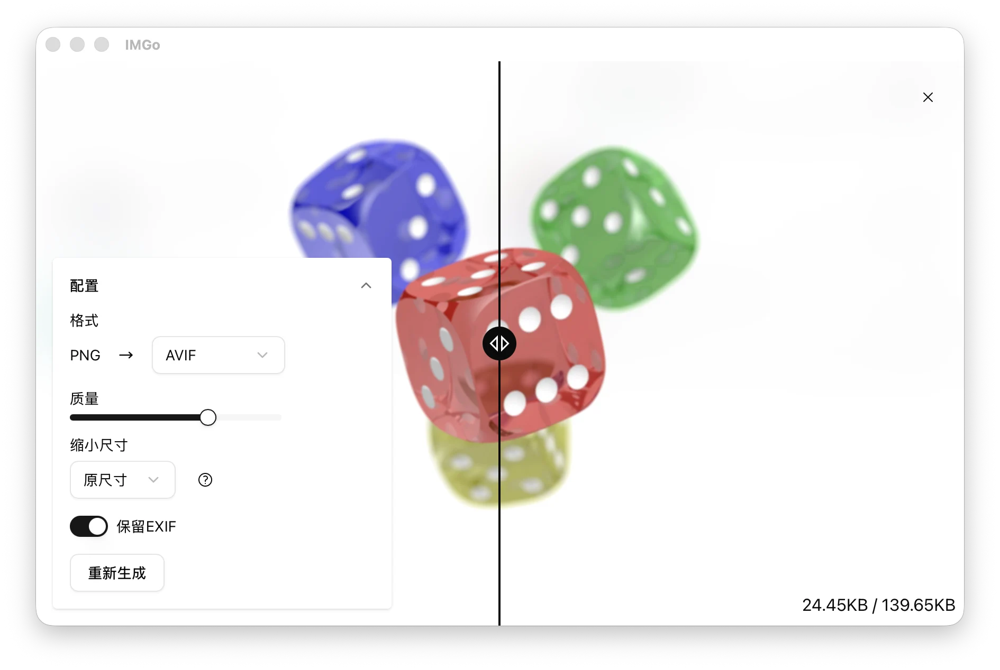

# IMGo

[English](./README.md) | [简体中文](./README.zh-CN.md)

> [!IMPORTANT]
> IMGo is the next-generation rewrite of the original [meowtec/Imagine](https://github.com/meowtec/Imagine). It replaces Electron with Tauri for a smaller desktop app, supports more image formats, and adds a full web version that runs directly in your browser.
>
> If you prefer the original UI interactions but need support for more formats, consider [Imagine-plus](https://github.com/xianfei/Imagine-plus).

IMGo (short for "image optimizer") is a private batch image compression and conversion tool. Process multiple images at once, adjust quality and dimensions, and convert between common formats without uploading your files.





## Features

- Batch image compression and conversion
- Local processing: images stay on your device
- Quality, lossless, resize, and metadata controls
- Support for animated PNG, GIF, WebP, and AVIF
- Native desktop apps for macOS, Windows, and Linux
- A browser version with no installation required

## Output Formats

| Version     | Output formats                                  |
| ----------- | ----------------------------------------------- |
| Web app     | JPEG, PNG, GIF, WebP, AVIF, HEIC                |
| Desktop app | JPEG, PNG, GIF, WebP, AVIF, HEIC, JPEG XL (JXL) |

Animated PNG, GIF, WebP, and AVIF output is supported.

## Use Online

Open [imgo.app](https://imgo.app/) and start processing images immediately. The web app runs locally in your browser, so your images do not need to be uploaded.

## Download the Desktop App

Download the latest version from [GitHub Releases](https://github.com/meowtec/imgo/releases).

| Platform | Download                       |
| -------- | ------------------------------ |
| macOS    | DMG for Apple Silicon or Intel |
| Windows  | Installer for ARM64 or x64     |
| Linux    | AppImage for ARM64 or x64      |

Choose the file that matches your operating system and processor, then open it to install or run IMGo.

The current Windows installer is unsigned, and the macOS app is not notarized. Your operating system may display a security warning the first time you open it.

If macOS prevents IMGo from opening, move `IMGo.app` to the Applications folder, open Terminal, and run:

```bash
xattr -cr "/Applications/IMGo.app"
```

Then open IMGo again.
